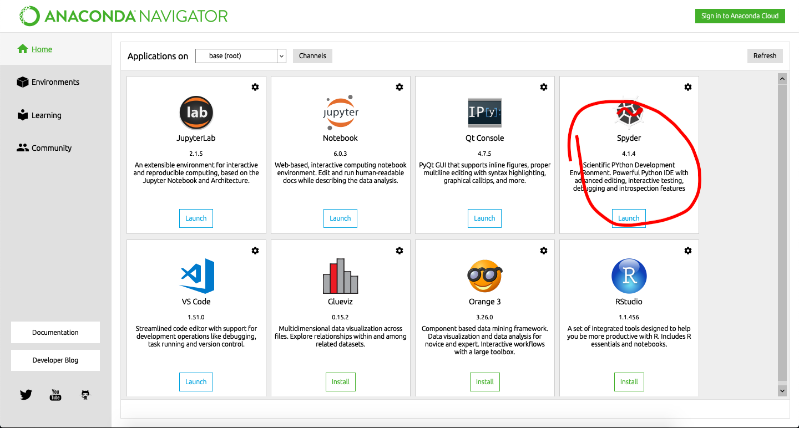
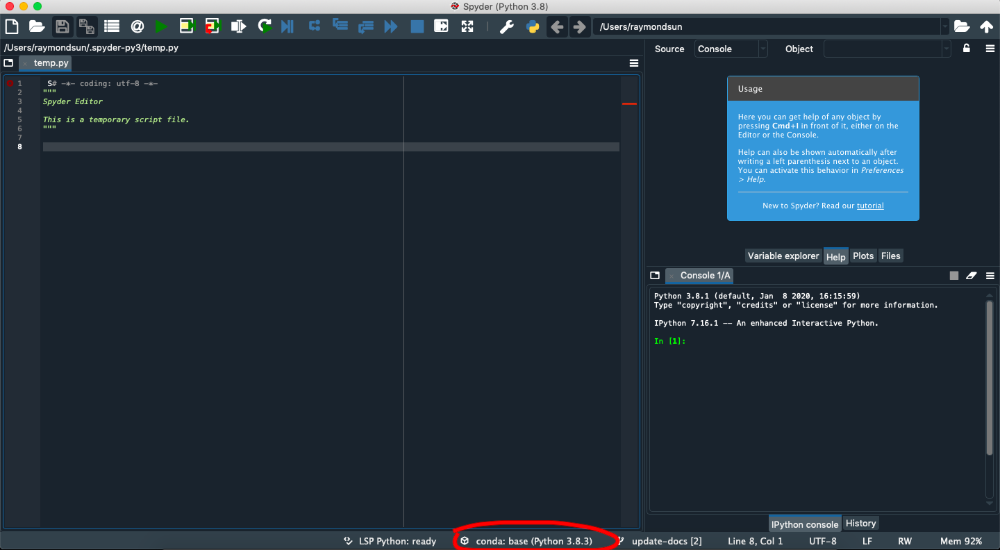
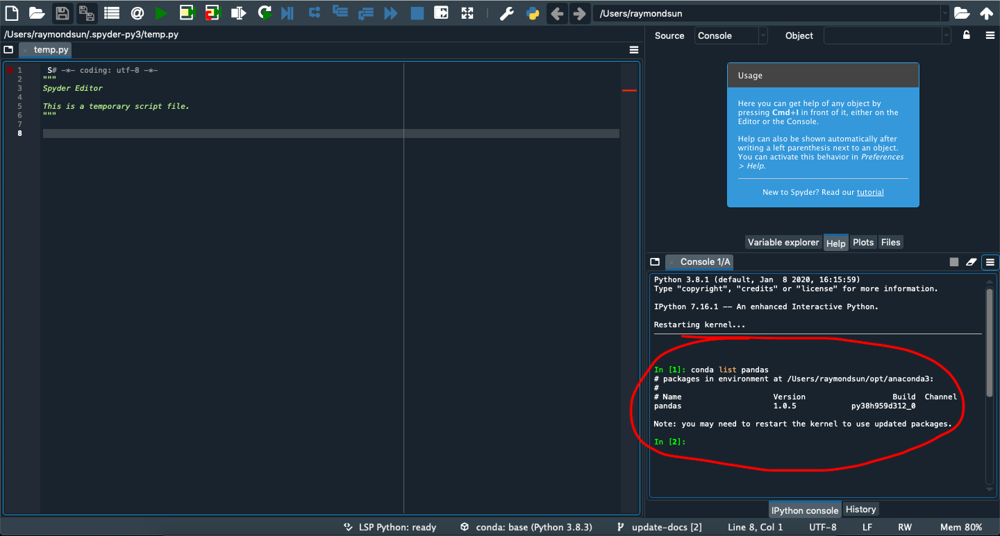
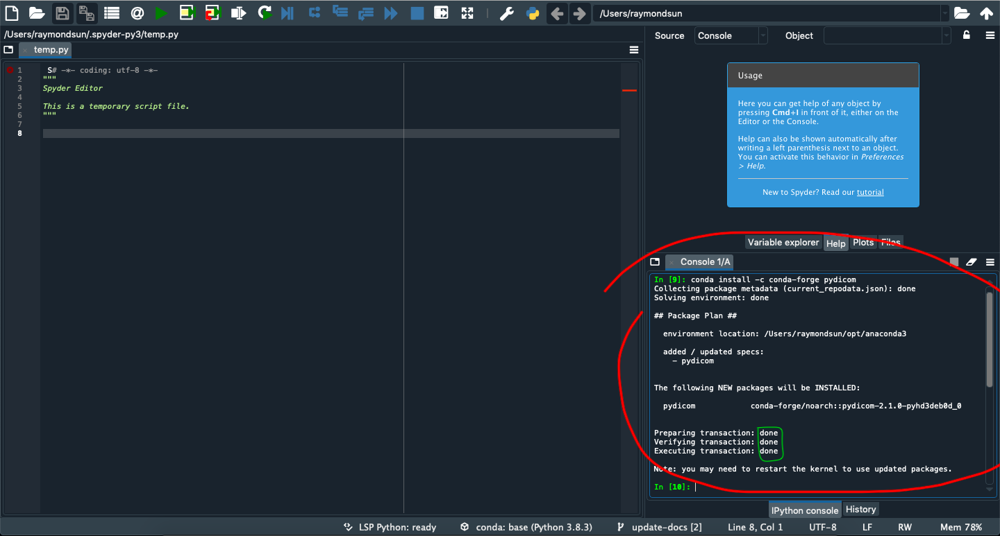
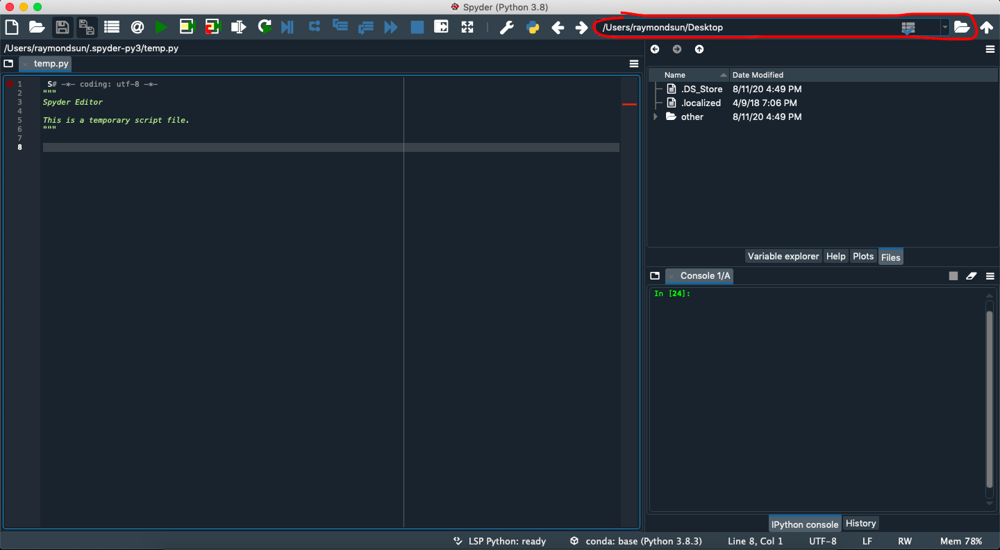
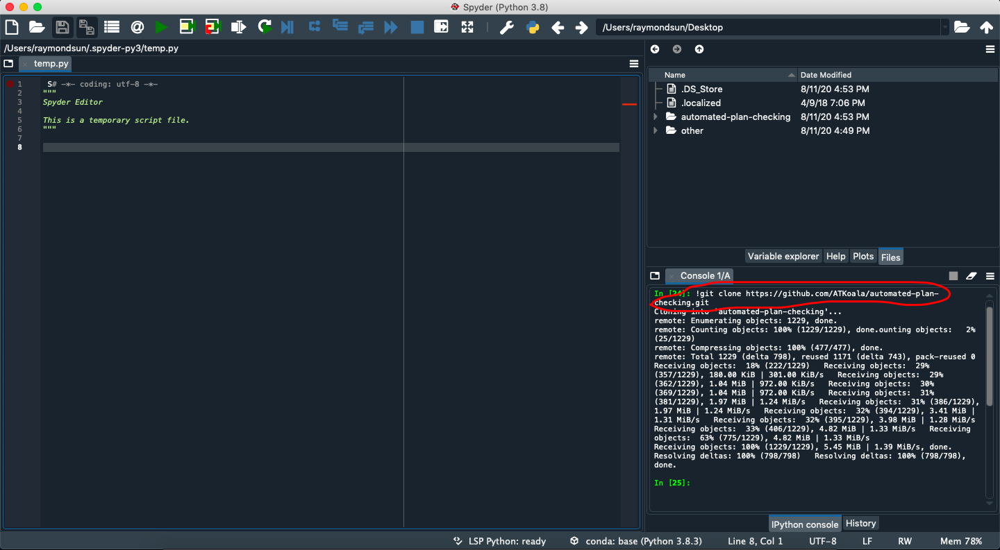
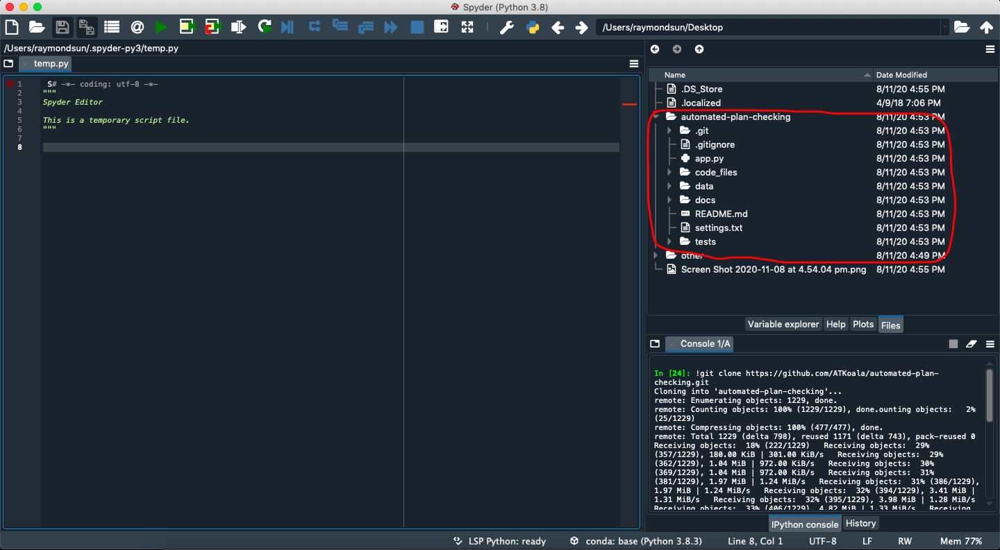
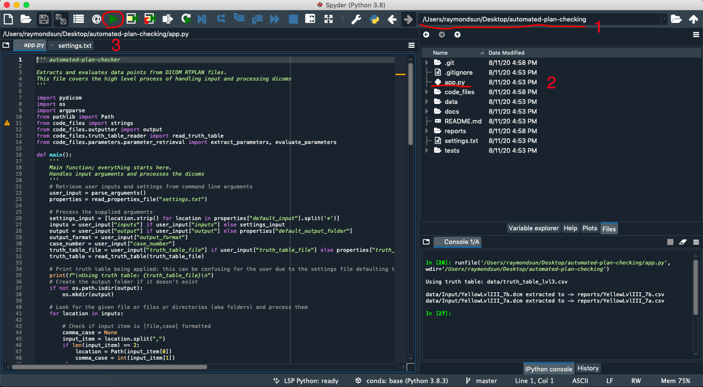

# automated-plan-checking

`Extract and evaluate data from DICOM RT-PLAN files.`

*README best viewed on the [github page](https://github.com/ATKoala/automated-plan-checking)*

## Table of contents

[**Project background**](#project-background)

[**System Setup**](#system-setup)

- [**Anaconda and Spyder**](#anaconda-setup)
- [**Pip and command line**](#pip-setup)

[**Installation and Usage**](#installation-and-usage)

- [**Installation**](#installation)
- [**Usage**](#usage)

[**Documentation List**](#documentation-list)

- [**For Users**](#for-users)
- [**For Developers**](#for-developers)

## Project background

This project is with the Australian Radiation Protection and Nuclear Safety Agency.

The aim is to create a program that can perform an automated check of data and parameters with a Pass/Fail result.

Currently, the process to verify planning parameters is to manually check pdf print outs. The information required is contained in the DICOM RT-PLAN files created for each treatment plan. The goal is a program that can directly extract the information from the DICOM file and then compare this data to a standard data set to produce a pass/fail evaluation.

## System Setup

Before you run the program, you will need to make sure your computer has the required software and libraries installed.
The following sections will guide you through this process.

### Anaconda Setup

If you have Anaconda or are willing to install Anaconda, the setup can be done with the following steps.

1. Open Spyder (from Anaconda Navigator in the image, but not required to open from Navigator)

2. Check the Python version. If it's lower than 3.6, run `conda update python` in the Spyder console.

3. Anaconda comes with the *pandas* package preinstalled, but check it with `conda list pandas` in the console.

    - If it's missing, try running `conda install pandas` in the console.

4. Install the *pydicom* package with `conda install -c conda-forge pydicom`

### Pip Setup

Without Anaconda, it's also possible to set up directly through the command line/shell, with "pip", the python package manager.

1. Ensure Python version 3.6 or higher by running `python --version` in the command line
2. Check that you can use pip, with `pip --version`. If it returns "pip is not recognized ...", try using `python -m pip --version` instead.
3. Install *pandas* (Check if already installed with `pip show pandas`. Installed with `pip install pandas`)
4. Install *pydicom* (Check with `pip show pydicom`. Install with `pip install pydicom`)

## Installation and Usage

### Installation

1. In Spyder, navigate to where you want the program to go. In the example below, we are saving it on the desktop.

2. In Spyder console, enter `!git clone https://github.com/ATKoala/automated-plan-checking.git`

3. The program will be downloaded as a folder "automated-plan-checking", in the working directory. (in this example on the desktop)

### Usage

1. In Spyder, navigate to the directory in which the program is saved and open *app.py*.
2. Click Run. On a fresh install from github, it will run the program on sample dicoms in the data/ folder.

3. It may be desirable to use the [settings file](settings.txt) and specify different input locations depending on where your dicoms are, each time you run the program.

More options for usage can be found in the [User guide](docs/User-Guide.pdf).

## Documentation List

### For Users

- [User Guide](docs/User-Guide.pdf)
- [Using Settings](docs/Settings.pdf)
- [Customising Truth Tables](docs/Writing-Truth-Tables.pdf)

### For Developers

- [Developing a new Parameter](docs/Adding-Parameters.pdf)
- [Architecture](docs/System-Design-and-Architecture.pdf) includes components of the program and how modules fit together.
- [Features](docs/User-Stories.pdf) shows the features completed and not completed, as well as notes on completed features.
- [Test cases](docs/Test-Cases.pdf) describes the results from manually testing various parts of the system.
- [Parameter Information](docs/Parameter-Information.pdf) contains some information about the parameters for future developers without domain knowledge.
