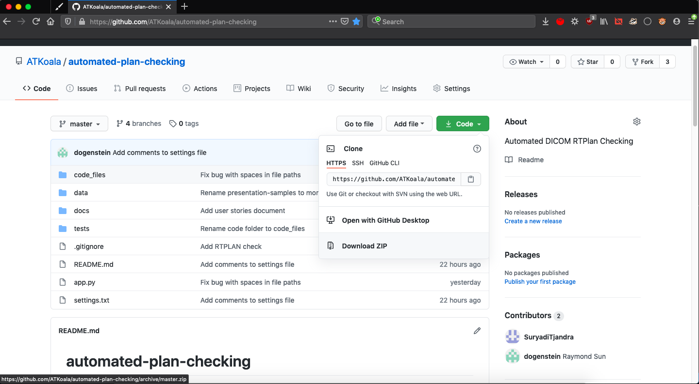

# automated-plan-checking

`Extract and evaluate data from DICOM RT-PLAN files.`

*README best viewed on the [github page](https://github.com/ATKoala/automated-plan-checking)*

## Table of contents

[**Project background**](#project-background)

[**System Setup**](#system-setup)

- [**Anaconda and Spyder**](#anaconda-setup)
- [**Pip and command line**](#pip-setup)

[**Installation and Usage**](#installation-and-usage)
  
- [**Usage**](#usage)

[**Documentation**](#documentation)

- [**For Users**](#for-users)
- [**For Developers**](#for-developers)

## Project background

This project is with the Australian Radiation Protection and Nuclear Safety Agency.

The aim is to create a program that can perform an automated check of data and parameters with a Pass/Fail result.

Currently, the process to verify planning parameters is to manually check pdf print outs. The information required is contained in the DICOM RT-PLAN files created for each treatment plan. The goal is a program that can directly extract the information from the DICOM file and then compare this data to a standard data set to produce a pass/fail evaluation.

## System Setup

Before you run the program, you will need to make sure your computer has the required software and libraries installed.
You will need Python 3.6 (or higher) installed, as well as the *pandas* and *pydicom* libraries.

### Anaconda Setup

ACDS computers come with Anaconda Navigator (which is a set of programs and software including Python, Spyder, Jupyter, etc..), so this will be the main entry point.

1. Open Spyder

2. Check the Python version. If it's lower than 3.6, run `conda update python` in the Spyder console.

3. Anaconda comes with the *pandas* package preinstalled, but check it with `conda list pandas` in the console.
    - If it's missing, try running `conda install pandas` in the console.

4. Install the *pydicom* package with `conda install -c conda-forge pydicom`

### Pip Setup

It's also possible to set up directly through the command line/shell, with "pip", the python package manager.

1. Ensure Python version 3.6 or higher by running `python --version` in the command line
2. Install *pandas* (Check if already insalled with `pip show pandas`. Can be installed with `pip install pandas`)
3. Install *pydicom* (Check with `pip show pydicom`. Can be installed with `pip install pydicom`)

## Installation and Usage

### Installation

1. Directly download the zip from: <https://github.com/ATKoala/automated-plan-checking/archive/master.zip>
    - Or, go to <https://github.com/ATKoala/automated-plan-checking>, click the green Code button and select "Download zip"
      

2. Unzip it and move it to wherever you want the program to live
3. You're done!

### Usage

1. In Spyder, navigate to the directory in which the program is saved and open app.py
2. Click Run. On a fresh insrall from github, it will run the program on sample dicoms in the data/ folder.

In the image above the folder was renamed from automated-plan-checking-master to automated-plan-checking.

Open the [settings file](settings.txt) to point the input, output and truth table settings to the desired locations.

More detailed instructions can be found in the [User guide](docs/User-Guide.pdf).

## Documentation

### For Users

- [User Guide](docs/User-Guide.pdf)
- [Using Settings](docs/Settings.pdf)
- [Customising Truth Tables](docs/Writing-Truth-Tables.pdf)

### For Developers

- [Developing a new Parameter](docs/Adding-Parameters.pdf)
- [User Stories](docs/User-Stories.pdf) shows the features completed and not completed, as well as notes on completed features.
- [Architecture](docs/System-Design-and-Architecture.pdf) includes components of the program and how modules fit together.
- [Test cases](docs/Test-Cases.pdf) describes the results from manually testing various parts of the system.
- [Parameter Information](docs/Parameter-Information.pdf) contains some information about the parameters for future developers without domain knowledge.
